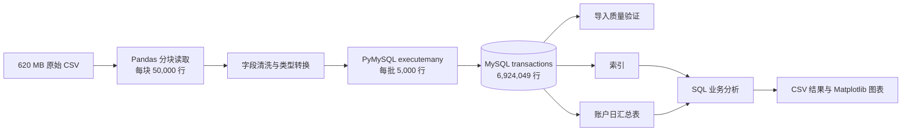

<div align="center">

# 百万级金融交易 ETL 与 SQL 分析

**使用 Python 分块处理与 MySQL，将 620 MB CSV 构建为可查询的金融交易分析库**


</div>

## 项目概览

本项目使用 IBM AML-Data 的 `LI-Small_Trans.csv`，实现从大型 CSV 到 MySQL 分析库的完整流程。项目重点不是训练另一个风险预测模型，而是处理百万级交易数据时的数据导入、质量验证、查询设计和性能优化。

Python 以 **5 万行为一块**读取原始数据，清洗字段后再以 **5,000 行为一批**写入 MySQL。导入完成后，使用索引、窗口函数和账户日汇总表支持大额交易、高频交易与洗钱标签的关联分析。

| 指标 | 结果 |
|---|---:|
| 原始 CSV 大小 | 约 620 MB |
| 完整交易数 | 6,924,049 |
| 洗钱标签交易数 | 3,565 |
| CSV 读取块大小 | 50,000 行 |
| MySQL 批量插入大小 | 5,000 行 |
| 高频组洗钱率（9月1日至10日） | 0.0971% |
| 普通组洗钱率（9月1日至10日） | 0.0417% |


## 技术路线



## 核心实现

### 1. 分块 ETL

直接把 620 MB CSV 一次读入内存，会产生远高于文件体积的内存占用。项目使用 `pandas.read_csv(..., chunksize=50_000)` 返回分块读取器，逐块完成：

1. 统一 11 个交易字段的名称；
2. 将交易时间转换为日期时间类型；
3. 将洗钱标签转换为整数 `0/1`；
4. 使用 `executemany` 批量写入 MySQL；
5. 每个 5 万行数据块独立提交事务。

完整导入脚本见 [`src/import_transactions_chunked.py`](src/import_transactions_chunked.py)。一次性读取的早期版本保留在 [`src/import_transactions.py`](src/import_transactions.py)，用于展示从样本导入到分块导入的迭代过程。

### 2. 数据完整性验证

导入后从三个角度检查结果：

- 总行数是否为 `6,924,049`；
- 洗钱标签交易数是否为 `3,565`；
- 交易时间范围是否与原始数据一致。

验证 SQL 见 [`sql/02_validate_import.sql`](sql/02_validate_import.sql)。

### 3. 查询性能优化

高频交易分析需要先按“日期、付款银行、付款账户”汇总，再按每日交易次数排序。直接在 692 万行交易表上重复执行分组和窗口计算，单次查询耗时超过 2 分钟。

项目将最昂贵的账户日聚合保存为 `daily_account_stats` 汇总表，并为日期与交易频次建立索引。后续排名和风险率查询直接读取汇总层，避免每次重新扫描并聚合原始交易表。

相关 SQL 见 [`sql/03_build_analytics_layer.sql`](sql/03_build_analytics_layer.sql)。

## 分析结果

### 高频交易与洗钱标签

高频账户日定义为：**每天按交易次数排名前 1% 的付款账户日**。

| 组别 | 账户日数量 | 交易数 | 洗钱交易数 | 洗钱率 |
|---|---:|---:|---:|---:|
| 高频组 | 21,185 | 979,344 | 951 | 0.0971% |
| 普通组 | 2,096,823 | 5,944,482 | 2,480 | 0.0417% |

高频组洗钱率约为普通组的 **2.33 倍**。这表示二者存在正向关联，但两组绝对洗钱率均低于 0.1%，高频特征不能单独用于认定洗钱。


### 异常尾部敏感性分析

9月11日至17日只有 223 笔交易，其中 134 笔带有洗钱标签，分布明显不同于主要交易日期。将这部分数据纳入后：

| 数据范围 | 高频组洗钱率 | 普通组洗钱率 | 相对倍数 |
|---|---:|---:|---:|
| 9月1日至10日 | 0.0971% | 0.0417% | 2.33 |
| 全部日期 | 0.0995% | 0.0436% | 2.28 |

结论方向没有改变，说明高频分析对是否包含异常尾部数据并不敏感。


### 大额交易与洗钱标签

大额交易定义为：**在各支付币种内部按金额排名前 1% 的交易**。这一分析使用早期的 100 万行开发样本，避免把不同币种的金额直接相加比较。

| 组别 | 交易数 | 洗钱交易数 | 洗钱率 |
|---|---:|---:|---:|
| 大额交易 | 10,007 | 6 | 0.060% |
| 其他交易 | 989,993 | 208 | 0.021% |

样本中大额交易组洗钱率约为其他交易的 **2.86 倍**，但大额组只有 6 个洗钱标签，结论需要谨慎解释。


分析 SQL 集中在 [`sql/04_business_analysis.sql`](sql/04_business_analysis.sql)，图表由 [`src/visualize_results.py`](src/visualize_results.py) 生成。

## 项目结构

```text
financial-transaction-warehouse/
├── data/
│   ├── raw/                         # 原始数据，本地保存且不进入 Git
│   └── processed/                   # 开发样本，本地保存且不进入 Git
├── outputs/figures/                 # 分析图表
├── sql/
│   ├── 01_create_schema.sql
│   ├── 02_validate_import.sql
│   ├── 03_build_analytics_layer.sql
│   └── 04_business_analysis.sql
├── src/
│   ├── create_sample.py             # 生成 100 万行开发样本
│   ├── import_transactions.py       # 早期一次性导入版本
│   ├── import_transactions_chunked.py
│   ├── test_connection.py
│   └── visualize_results.py
├── .env.example
├── .gitignore
├── README.md
└── requirements.txt
```

## 快速复现

### 1. 准备环境

要求 Python 3.13（项目测试版本）和支持窗口函数的 MySQL 8.0+。

```powershell
python -m venv .venv
.\.venv\Scripts\Activate.ps1
python -m pip install -r requirements.txt
Copy-Item .env.example .env
```

在 `.env` 中填写本地 MySQL 连接信息。`.env` 已加入 `.gitignore`，不会上传密码。

### 2. 准备数据

从 IBM AML-Data 下载 `LI-Small_Trans.csv`，放置到：

```text
data/raw/LI-Small_Trans.csv
```

原始数据体积较大且受单独的数据许可约束，因此不包含在本仓库中。

### 3. 创建数据库并导入

先在 MySQL 中运行：

```text
sql/01_create_schema.sql
```

确认 `transactions` 是空表后执行：

```powershell
python src/test_connection.py
python src/import_transactions_chunked.py
```

当前导入器会按块提交，但尚不支持断点续传。如果中途失败，已提交的数据仍会保留；从头重跑前必须先清空交易表，避免重复导入。

### 4. 验证并分析

按顺序运行：

```text
sql/02_validate_import.sql
sql/03_build_analytics_layer.sql
sql/04_business_analysis.sql
```

将查询结果导出为项目根目录下的三个 CSV 后，可重新生成图表：

```powershell
python src/visualize_results.py
```

## 数据来源与使用边界

- 数据来源：[IBM AML-Data](https://github.com/IBM/AML-Data)
- 论文：[Realistic Synthetic Financial Transactions for Anti-Money Laundering Models](https://proceedings.neurips.cc/paper_files/paper/2023/file/5f38404edff6f3f642d6fa5892479c42-Paper-Datasets_and_Benchmarks.pdf)
- 数据许可：[Community Data License Agreement – Sharing – Version 1.0](https://cdla.dev/sharing-1-0/)

该数据由多智能体虚拟世界模型生成，不来自真实客户。项目结论只能描述该合成数据中的关联，不能直接外推为真实银行的洗钱规律，也不能用于真实交易决策。

## 已知限制

- 大额交易结果来自 100 万行开发样本，高频交易结果来自完整数据，二者不能直接作同口径比较。
- `NTILE(100)` 可能把交易次数相同的账户日分到相邻组别。
- 不同币种没有统一汇率，金额不能跨币种直接求和比较。
- 洗钱标签极少，倍数差异需要和绝对风险、阳性数量一起解释。
- 当前导入器不具备幂等写入和断点续传能力。

## 项目定位

本项目展示的是大型 CSV 的分块 ETL、MySQL 批量写入、数据质量验证、索引设计、窗口函数和汇总层优化能力。业务分析用于验证数据管道和分析层是否可用，不以机器学习建模为目标。
