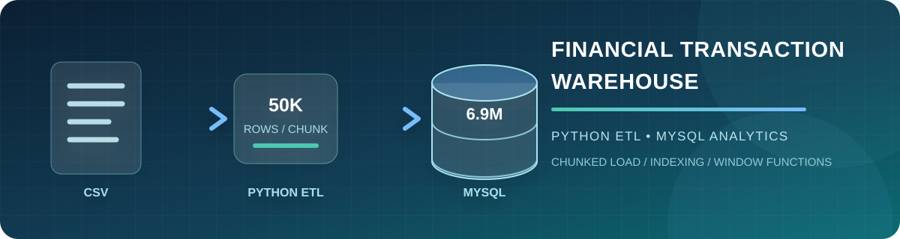
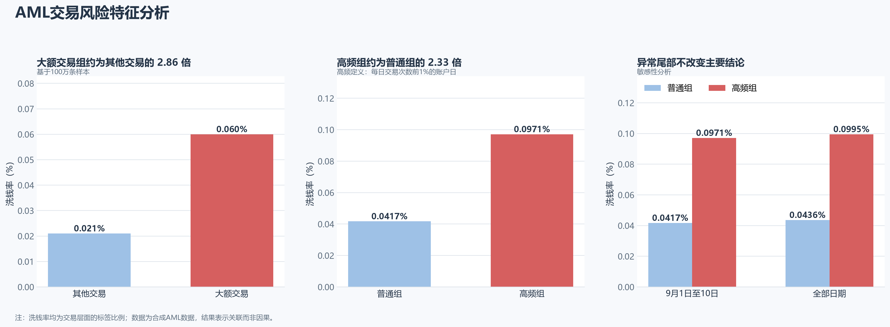
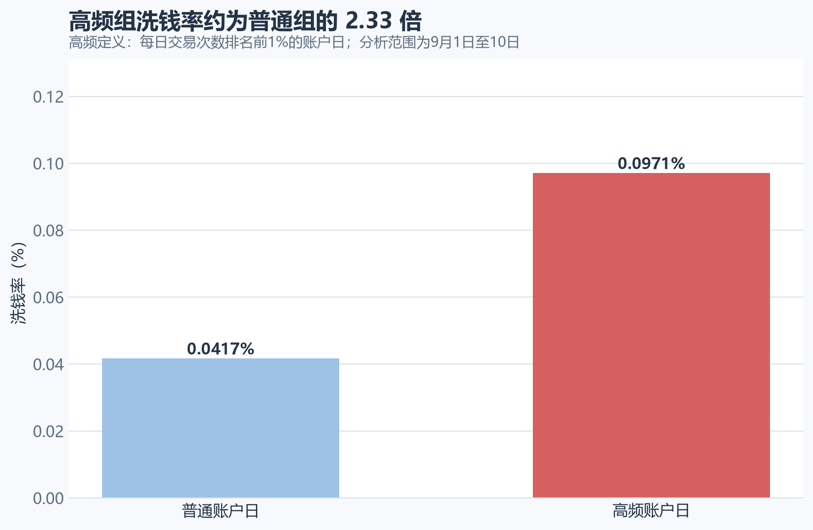
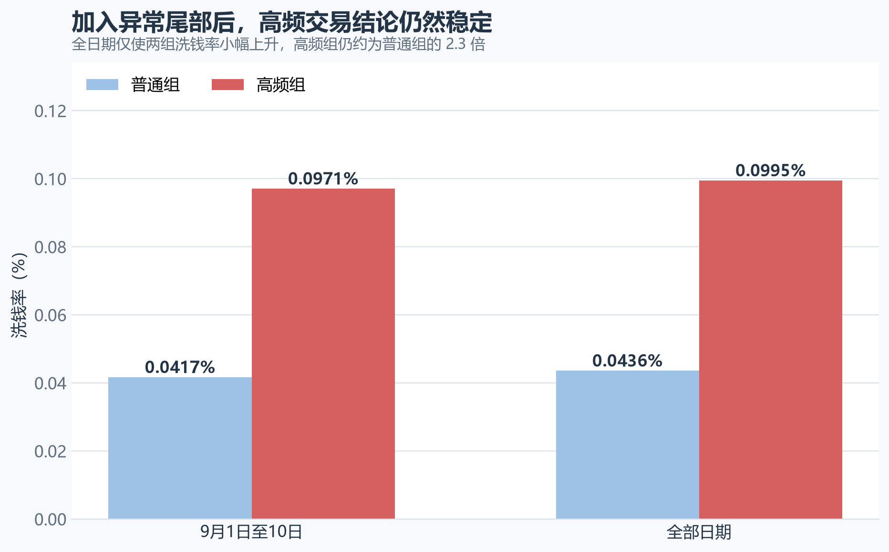
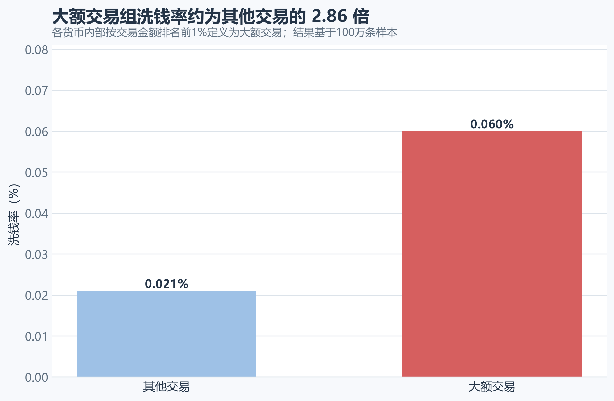
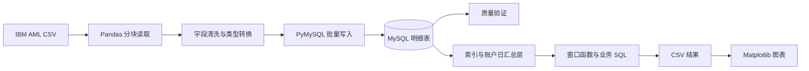

<div align="center">



# 百万级金融交易 ETL 与 SQL 分析

**从 620 MB 原始 CSV 到 692 万行 MySQL 分析库的可复现数据工程项目**

[](https://www.python.org/)
[](https://www.mysql.com/)
[](https://pandas.pydata.org/)

[](https://cdla.dev/sharing-1-0/)

[项目摘要](#项目摘要) · [工程实现](#工程实现) · [分析结果](#分析结果) · [技术路线](#技术路线) · [快速复现](#快速复现)

</div>

## 项目摘要

本项目使用 IBM AML-Data 的 `LI-Small_Trans.csv`，搭建一条从大型 CSV 到 MySQL 分析层的完整数据流程。重点不是再训练一个风险预测模型，而是展示百万级交易数据的 **分块读取、批量写入、质量验证、索引设计、窗口函数和汇总层优化**。

| 原始文件 | 完整交易数 | 洗钱标签数 | 读取块大小 | 插入批次 |
|:---:|:---:|:---:|:---:|:---:|
| **约 620 MB** | **6,924,049** | **3,565** | **50,000 行** | **5,000 行** |

> 阅读重点：先看数据如何可靠进入 MySQL，再看索引和账户日汇总层如何支撑高频交易分析。原始数据与数据库密码均不进入仓库。

## 工程实现

### 1. 分块 ETL：控制内存并批量入库

大型 CSV 被 Pandas 读入后，内存占用通常远高于文件体积。项目使用 `read_csv(..., chunksize=50_000)` 逐块读取，每块依次完成字段统一、时间转换、标签转换和 MySQL 写入。

| 问题 | 实现 | 作用 |
|---|---|---|
| CSV 无法安全一次读入 | 每次读取 50,000 行 | 将内存占用控制在固定范围 |
| 逐行插入速度慢 | `executemany` 每批写入 5,000 行 | 减少数据库往返次数 |
| 全量事务过大 | 每个数据块独立提交 | 限制单次事务规模 |
| 字段含义不统一 | 统一 11 个字段并转换时间、标签 | 保证数据库类型可用 |

完整实现见 [`src/import_transactions_chunked.py`](src/import_transactions_chunked.py)。早期一次性读取版本保留在 [`src/import_transactions.py`](src/import_transactions.py)，用于展示从开发样本到全量分块导入的迭代过程。

### 2. 数据完整性验证

导入完成后，通过 SQL 同时核对：

- 总行数是否为 `6,924,049`；
- 洗钱标签交易数是否为 `3,565`；
- 最早与最晚交易时间是否覆盖原始数据范围；
- 标签 `0/1` 的记录数是否与源数据一致。

验证脚本见 [`sql/02_validate_import.sql`](sql/02_validate_import.sql)。

### 3. SQL 分析层与性能优化

高频交易分析需要先按“日期、付款银行、付款账户”汇总，再按每日交易次数排序。直接在 692 万行明细表上重复执行分组和窗口计算，首次查询耗时超过 2 分钟。

项目将最昂贵的账户日聚合保存为 `daily_account_stats`，并为交易时间、付款账户、币种金额以及每日频次建立索引。后续分析直接读取汇总层，避免反复扫描并聚合原始交易表。

```text
transactions（6,924,049 笔交易）
        │
        ├── 明细索引：时间 / 付款账户 / 币种金额
        │
        └── daily_account_stats（账户日汇总层）
                         │
                         └── 高频排名 / 风险率 / 敏感性分析
```

建表与索引脚本见 [`sql/03_build_analytics_layer.sql`](sql/03_build_analytics_layer.sql)。

## 分析结果



### 高频交易与洗钱标签

高频账户日定义为：**每天按交易次数排名前 1% 的付款账户日**。

| 组别 | 账户日数量 | 交易数 | 洗钱交易数 | 洗钱率 |
|---|---:|---:|---:|---:|
| 高频组 | 21,185 | 979,344 | 951 | **0.0971%** |
| 普通组 | 2,096,823 | 5,944,482 | 2,480 | **0.0417%** |

高频组洗钱率约为普通组的 **2.33 倍**。这表示二者存在正向关联，但两组绝对洗钱率均低于 0.1%，高频特征不能单独用于认定洗钱。

### 异常尾部敏感性分析

9月11日至17日只有 223 笔交易，其中 134 笔带有洗钱标签，分布明显不同于主要交易日期。纳入这部分数据后，高频组与普通组洗钱率分别为 `0.0995%` 和 `0.0436%`，相对倍数从 `2.33` 变为 `2.28`，结论方向没有改变。

<table>
  <tr>
    <td width="50%"></td>
    <td width="50%"></td>
  </tr>
  <tr>
    <td align="center"><b>高频账户日与普通账户日对比</b></td>
    <td align="center"><b>异常尾部不改变主要结论</b></td>
  </tr>
</table>

### 大额交易与洗钱标签

大额交易定义为：**在各支付币种内部按金额排名前 1% 的交易**。这一分析使用早期的 100 万行开发样本，避免把不同币种的金额直接相加比较。

- 大额交易组：10,007 笔交易，6 笔洗钱标签，洗钱率 `0.060%`；
- 其他交易组：989,993 笔交易，208 笔洗钱标签，洗钱率 `0.021%`；
- 样本中大额交易组约为其他交易的 **2.86 倍**，但阳性样本仅 6 笔，需要谨慎解释。



业务查询集中在 [`sql/04_business_analysis.sql`](sql/04_business_analysis.sql)，图表由 [`src/visualize_results.py`](src/visualize_results.py) 生成。

## 技术路线



## 项目结构

```text
financial-transaction-warehouse/
├── data/
│   ├── raw/                         # 原始数据，不进入 Git
│   └── processed/                   # 开发样本，不进入 Git
├── docs/assets/                     # README 横幅素材
├── outputs/figures/                 # 代码生成的分析图表
├── sql/
│   ├── 01_create_schema.sql
│   ├── 02_validate_import.sql
│   ├── 03_build_analytics_layer.sql
│   └── 04_business_analysis.sql
├── src/
│   ├── create_sample.py
│   ├── import_transactions.py
│   ├── import_transactions_chunked.py
│   ├── test_connection.py
│   └── visualize_results.py
├── .env.example
├── .gitattributes
├── .gitignore
├── README.md
└── requirements.txt
```

## 快速复现

要求 Python 3.13（项目测试版本）和支持窗口函数的 MySQL 8.0+。

### 1. 安装依赖

```powershell
python -m venv .venv
.\.venv\Scripts\Activate.ps1
python -m pip install -r requirements.txt
Copy-Item .env.example .env
```

在 `.env` 中填写本地 MySQL 连接信息。该文件已被 Git 忽略，不会上传数据库密码。

### 2. 准备数据与数据库

从 IBM AML-Data 下载 `LI-Small_Trans.csv`，保存到：

```text
data/raw/LI-Small_Trans.csv
```

在 MySQL 中运行 [`sql/01_create_schema.sql`](sql/01_create_schema.sql)，然后执行：

```powershell
python src/test_connection.py
python src/import_transactions_chunked.py
```

### 3. 验证并分析

按顺序运行：

```text
sql/02_validate_import.sql
sql/03_build_analytics_layer.sql
sql/04_business_analysis.sql
```

导出查询结果 CSV 后，可重新生成图表：

```powershell
python src/visualize_results.py
```

> 当前导入器会按块提交，但尚不支持断点续传。如果中途失败，已提交的数据仍会保留；从头重跑前必须先清空交易表，避免重复导入。

## 数据来源与使用边界

- 数据来源：[IBM AML-Data](https://github.com/IBM/AML-Data)
- 论文：[Realistic Synthetic Financial Transactions for Anti-Money Laundering Models](https://proceedings.neurips.cc/paper_files/paper/2023/file/5f38404edff6f3f642d6fa5892479c42-Paper-Datasets_and_Benchmarks.pdf)
- 数据许可：[Community Data License Agreement – Sharing – Version 1.0](https://cdla.dev/sharing-1-0/)

该数据由多智能体虚拟世界模型生成，不来自真实客户。项目结论只能描述该合成数据中的关联，不能直接外推为真实银行的洗钱规律，也不能用于真实交易决策。

## 已知限制

- 大额交易结果来自 100 万行开发样本，高频交易结果来自完整数据，二者不能直接作同口径比较。
- `NTILE(100)` 可能把交易次数相同的账户日分到相邻组别。
- 不同币种没有统一汇率，金额不能跨币种直接求和比较。
- 洗钱标签极少，倍数差异需要和绝对风险、阳性数量一起解释。
- 当前导入器不具备幂等写入和断点续传能力。

## 项目定位

本项目展示大型 CSV 的分块 ETL、MySQL 批量写入、数据质量验证、索引设计、窗口函数和汇总层优化能力。业务分析用于验证数据管道和分析层是否可用，暂无机器学习建模内容。
